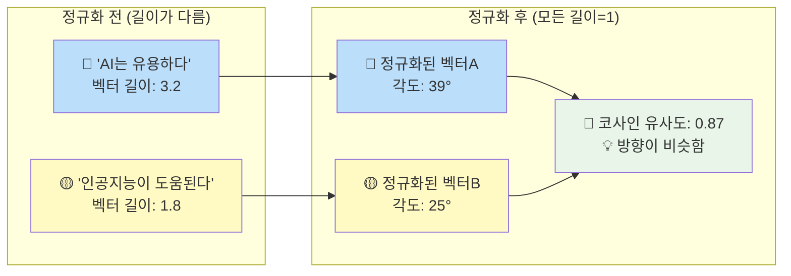
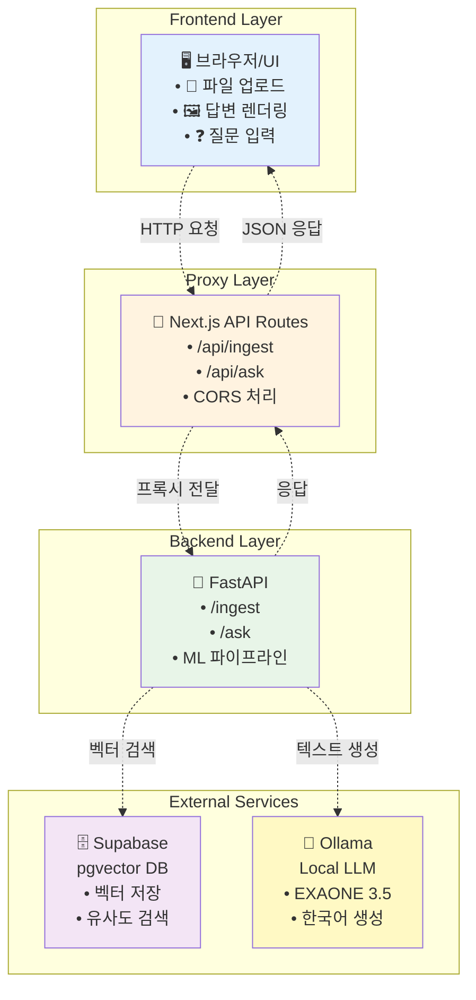
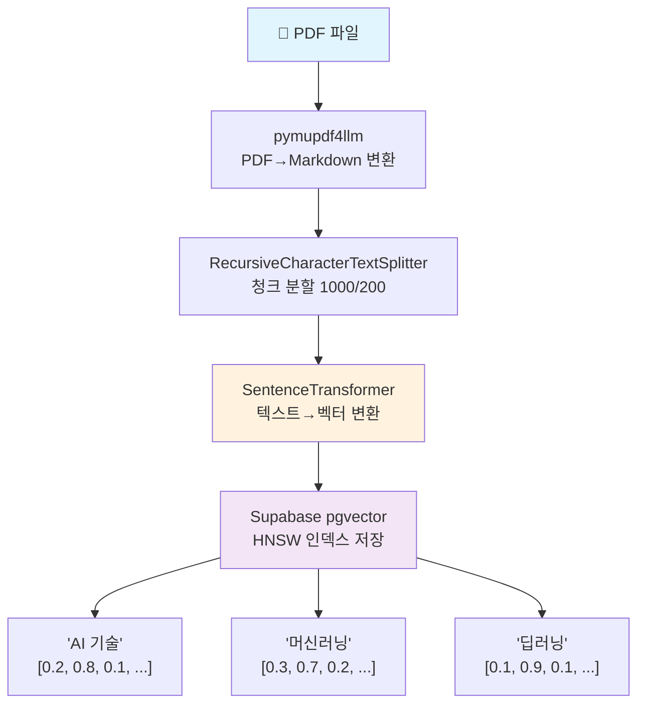
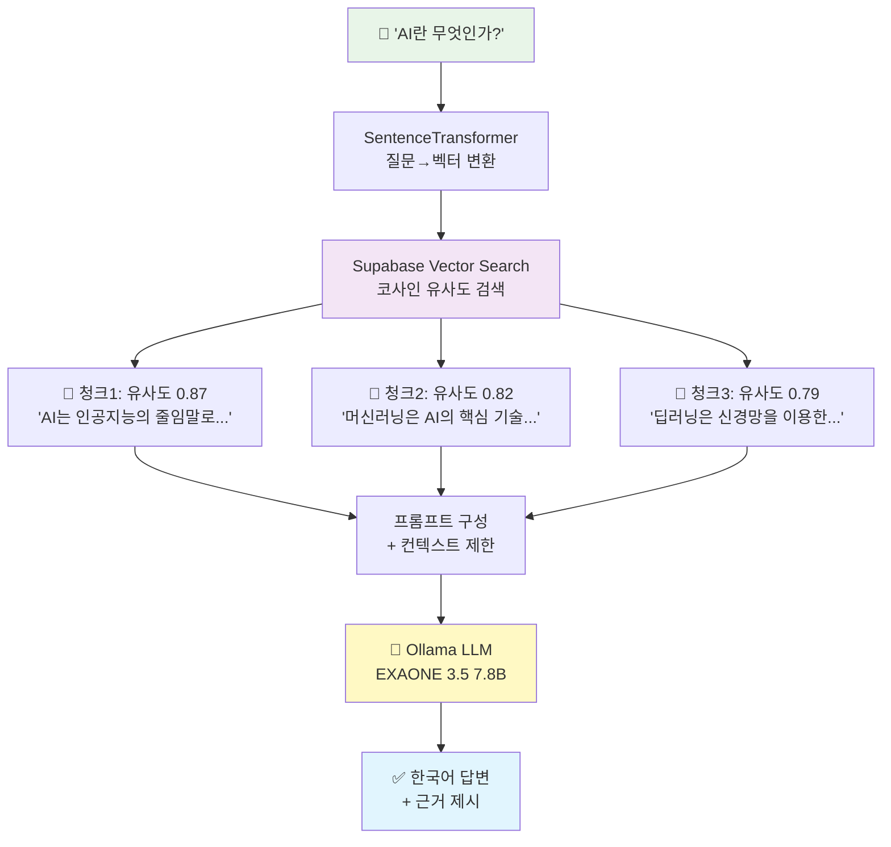

## PDF RAG 파이프라인: 라이브러리 선택의 이유와 동작 원리

이 글은 내가 구축한 RAG 파이프라인에서 각 라이브러리가 왜 필요한지(Why), 무엇을 하는지(What), 어떻게 동작하는지(How)를 정리한 학습 노트다. 프로젝트 소개/세팅은 여기서 제외한다.

### 1) pymupdf4llm: PDF를 "읽을 수 있는 글"로 되돌리는 과정

PDF는 사람이 보기엔 정돈돼 보이지만, 기계에게는 "좌표에 흩어진 글상자들의 모음"에 가깝다. 그래서 단순히 텍스트만 긁어오면 문단이 끊기거나 표가 풀려버리고, 제목과 본문이 섞이기 일쑤다. 내가 `pymupdf4llm`을 쓴 이유는, 이 라이브러리가 PDF 페이지를 사람의 읽기 흐름에 가깝게 재구성해 LLM이 바로 이해할 수 있는 Markdown으로 정리해 주기 때문이다.

동작 흐름은 이렇다. 먼저 PyMuPDF 엔진을 통해 페이지를 훑으면서 텍스트 블록과 그 위치 정보를 가져온다. 그다음 줄 간격, 폰트 크기, 굵기 같은 힌트를 이용해 제목과 본문, 리스트, 인용 등의 역할을 가늠한다. 제목처럼 보이는 라인은 `#`, `##` 같은 헤더 마크업으로 바꾸고, 실제로 글머리 기호가 보이는 영역은 `-`, `1.` 같은 Markdown 리스트로 다시 그린다. 표는 셀 경계와 정렬을 추정해 Markdown 테이블로 최대한 복구한다. 페이지 번호, 머리글/바닥글처럼 의미 없는 반복 요소는 가능한 한 걸러내 맥락을 흐리지 않도록 한다.

핵심은 "내용을 잃지 않되, 구조를 되살리는 것"이다. 결과물은 제목 → 본문 → 리스트/표 순으로 자연스럽게 이어지는 Markdown 문서다. 이렇게 만들어진 텍스트는 이후 청크 분할로 넘어가도 문장이 도중에 끊기거나 섹션 경계가 뒤섞일 확률이 낮다. 결국 `pymupdf4llm`은 PDF의 시각적 레이아웃을 언어적 구조로 번역해 주는 단계이고, 이 번역이 잘 돼야 뒤의 임베딩·검색·생성이 안정적으로 작동한다.

### 2) RecursiveCharacterTextSplitter: 문맥을 지키면서 잘게 나누기

이 단계의 목표는 "LLM이 무리 없이 삼킬 수 있는 크기"로 텍스트를 자르되, 의미를 해치지 않는 것이다. 나는 먼저 문단·제목 경계를 최대한 존중하고, 그다음 문장 단위, 마지막으로 불가피할 때만 문자 단위로 내려간다. 이렇게 긴 것에서 짧은 것으로 내려가는 재귀 규칙을 쓰면, 단순히 글자를 일정 길이로 자를 때보다 문맥 보존율이 높다. 겹침(overlap)을 200 정도 주는 이유도 같다. 질문이 걸치는 정보가 바로 다음 청크에 걸쳐 있어도, 겹침 덕분에 검색 단계에서 놓칠 확률이 줄어든다.

### 3) SentenceTransformer: 문장을 숫자 공간으로 옮기는 일

텍스트를 벡터로 바꾸는 순간, "말은 다르지만 뜻은 같은" 문장을 서로 가깝게 놓을 수 있다. 나는 기본으로 `all-MiniLM-L6-v2`를 썼다. 가볍고 빠르며 일반 도메인에서 안정적이다. 임베딩을 만든 뒤에는 정규화를 해서 각 벡터의 길이를 1로 맞춘다. 이렇게 해야 나중에 코사인 유사도로 비교할 때 길이 차이가 주는 잡음이 줄어든다. 한국어 중심 문서를 많이 다룬다면, e5 계열처럼 다국어에 강한 모델로 바꾸고 처음부터 다시 임베딩을 만드는 편이 낫다.

> 문장을 그대로 비교하면 표현이 조금만 달라도 컴퓨터는 다르게 본다. 그래서 문장을 숫자 벡터로 바꿔 "뜻이 비슷하면 가깝게, 다르면 멀게" 배치하는데, 이 변환기를 임베딩 모델이라고 부른다.
all-MiniLM-L6-v2는 SBERT 계열을 작게 증류해 만든 경량 임베딩 모델로, 한 문장을 384차원 벡터(숫자 384개)로 바꿔 준다. 크기가 작고 빠르기 때문에 로컬에서 많은 청크를 짧은 지연으로 처리하기 좋다.

> 임베딩은 길이(세기)가 제각각일 수 있다. 검색에서는 "세기"보다 "방향(뜻의 방향)"이 중요하므로, 벡터 길이를 1로 맞추는 정규화를 함께 한다. 이렇게 하면 코사인 유사도(두 벡터의 각도 유사도)가 의미적 비슷함을 더 잘 반영한다. 직관적으로 두 화살표가 같은 방향일수록 1에 가깝다.

#### 📊 벡터 정규화와 코사인 유사도 시각화

**코사인 유사도 점수 해석:**
- `1.0`: 완전히 같은 방향 (의미가 거의 동일)
- `0.8~0.9`: 매우 유사한 의미
- `0.5~0.7`: 어느 정도 관련 있음
- `0.0`: 수직 (전혀 관련 없음)
- `-1.0`: 완전히 반대 방향

> 💡 **핵심**: 길이(세기)는 무시하고 "방향(의미)"만으로 유사도를 판단

> 다만 all-MiniLM-L6-v2는 학습 데이터가 영어 쪽에 무게가 있다. 한국어 전문 문서를 많이 다룬다면 intfloat/multilingual-e5-base 같은 다국어 강점 모델이 더 일관적일 수 있다. 임베딩 모델을 바꾸면 기준이 달라지므로, 기존 문서는 "다시 임베딩 → 다시 저장(재인덱싱)"이 필요하다.

### 4) Supabase pgvector: "뜻이 비슷한 조각들"을 클라우드에서 빠르게 찾아주는 데이터베이스

> Supabase는 Firebase의 오픈소스 대안으로, PostgreSQL 기반의 백엔드 서비스를 제공합니다. pgvector 확장을 통해 벡터 데이터를 저장하고 검색할 수 있으며, HNSW 인덱스를 지원해 대규모 벡터 검색에서도 뛰어난 성능을 보입니다. 클라우드 기반이므로 확장성과 안정성을 확보할 수 있고, SQL로 벡터 검색과 일반 데이터 쿼리를 함께 처리할 수 있습니다.
실제 프로덕션 환경을 고려하면 관리형 서비스의 장점이 크며, 백업, 복구, 모니터링이 자동으로 제공됩니다.

우리가 문장을 임베딩하면 각 문장은 고차원 숫자 벡터가 된다. 문제는 이렇게 벡터가 수천·수만 개 쌓이면, 매번 전부를 하나씩 비교하는 건 너무 느리다는 점이다. 여기서 Supabase pgvector가 등장한다. PostgreSQL에 벡터 검색 기능을 더한 확장으로, 이 벡터들을 클라우드에서 안전하게 보관해 두고, "이 벡터와 가장 비슷한 것들"을 순식간에 꺼내 주는 벡터 데이터베이스다. 책으로 비유하면, 책 내용(문장 의미)을 숫자 좌표로 바꿔 카드에 적어 두고, 비슷한 카드만 바로 찾아주는 "클라우드 사서" 같은 역할을 한다.

- 무엇을 저장하나
  - id: 각 청크를 구분하는 고유 ID (`doc_uuid_index` 형태)
  - embedding: 임베딩 벡터(예: 384차원) - `VECTOR(384)` 타입
  - content: 원본 청크 텍스트
  - metadata: 출처 파일명, 문서 ID, 청크 인덱스 등 검색 후 보여줄 근거 정보 (JSONB 형태)
  - source_name, chunk_index: 구조화된 메타데이터

- 어떻게 찾나
  1) 질문도 같은 임베딩 모델로 숫자 벡터로 바꾼다.
  2) RPC 함수 `search_document_chunks`를 호출해 "코사인 거리" 기준으로 가까운 벡터 top_k개를 고른다.
  3) 그에 해당하는 청크 텍스트와 메타데이터, 유사도 점수를 함께 돌려준다.
  내부적으로는 HNSW(Hierarchical Navigable Small World) 인덱스를 써서 "정확도는 크게 잃지 않으면서" "속도는 훨씬 빠르게" 만든다.

> 직관적으로 말하면, 벡터는 방향(뜻)을 가진 화살표다. 코사인 유사도는 "두 화살표가 얼마나 같은 방향을 보나"를 재는 잣대다. 같은 뜻일수록 값이 1에 가까워져서 상위로 올라온다. pgvector에서는 코사인 거리(`<=>` 연산자)를 사용해 검색한다.

- 왜 Supabase를 썼나
  - 클라우드 기반으로 확장성과 안정성을 확보할 수 있다.
  - PostgreSQL 기반이라 벡터 검색과 일반 SQL 쿼리를 함께 쓸 수 있다.
  - HNSW 인덱스로 대규모 벡터 검색에서도 뛰어난 성능을 보인다.
  - 관리형 서비스라 백업, 복구, 모니터링이 자동으로 제공된다.
  - 우리 프로젝트에서는 `document_chunks` 테이블에 영구 저장되고, RPC 함수로 검색한다.

- 자주 겪는 함정
  - 임베딩 정규화 누락: 코사인 유사도를 쓸 때는 벡터 길이를 1로 맞추는 정규화를 해 두면 잡음이 줄고 결과가 안정적이다.
  - 모델 교체 후 재인덱싱 미흡: 임베딩 모델을 바꾸면 "숫자 공간" 자체가 달라진다. 기존 데이터는 전부 다시 임베딩해서 저장해야 한다.
  - match_threshold 조절 실패: 너무 높으면 결과가 없고, 너무 낮으면 관련 없는 내용까지 포함된다(0.1~0.8 사이에서 조정).
  - top_k 조절 실패: 너무 작으면 놓치고, 너무 크면 잡음이 늘어난다(3~8 사이에서 문서 특성에 맞게 조정).
  - chunk 설정 불일치: `chunk_size/overlap`이 과도하면 프롬프트가 비대해지고, 너무 작으면 문맥이 끊긴다(현재 1000/200로 시작).

### 5) FastAPI: 무거운 일을 맡기는 작업장

PDF 파싱, 임베딩 생성, 벡터 DB 입출력은 전부 Python 쪽 생태계가 단단하다. 그래서 이 일들은 FastAPI로 묶었다. 업로드가 들어오면 PDF를 Markdown으로 풀고, 그 결과를 청크로 나눈 다음, 임베딩을 만들어 Supabase에 넣는다. 질문이 들어오면 임베딩을 만들고, Supabase에서 가까운 조각을 가져와 간단한 지시와 함께 하나의 프롬프트로 엮는다. 이 백엔드는 "최대한 얇게" 유지하면서도, 모델과 파라미터를 바꾸기 쉽게 설계했다.

### 6) Next.js API Route(프록시): 프론트에서 백엔드까지 안전하게

브라우저가 바로 백엔드를 두드리게 하면 신경 쓸 게 많아진다. 나는 Next.js의 API 라우트를 얇은 프록시로 세워, 업로드는 FormData 그대로, 질문은 JSON으로 백엔드에 전달하게 했다. 이렇게 하면 인증, 헤더, 에러 처리 규칙을 한 곳에서 통제할 수 있고, 프론트 코드는 간결하게 유지된다. 개발 중 CORS 문제도 자연스럽게 사라진다.

#### 🏗️ 하이브리드 아키텍처 구조도

**각 레이어의 역할:**
- **브라우저**: UI/UX, 파일 업로드, 답변 렌더링
- **Next.js API**: CORS 해결, 요청 프록시, 에러 처리
- **FastAPI**: ML 파이프라인 (PDF파싱, 임베딩, 프롬프트)
- **Supabase**: 클라우드 벡터 저장소, 유사도 검색
- **Ollama**: 로컬 LLM 서버, 한국어 답변 생성

**왜 이렇게 분리했나:**
- Next.js: 서버리스 특성상 ML 모델 로딩에 부적합
- FastAPI: Python ML 생태계 활용, 모델 최적화 용이
- 프록시 패턴: 인증/보안/에러 처리 중앙집중화

### 7) Ollama + EXAONE 3.5 7.8B(Instruct): 한국어 문서를 더 자연스럽게 읽는 답변자

한국어 PDF를 다루다 보니, 답변이 영어 중심 모델보다 조금 더 자연스럽고 안정적이면 좋겠다고 느꼈다. 그래서 LGAI의 EXAONE 3.5 7.8B 지시형 모델로 바꿨다. 로컬 Ollama에서 `exaone3.5:7.8b` 태그로 쉽게 불러올 수 있고, 긴 문맥 처리에도 강해 긴 섹션을 근거로 붙여도 호흡이 유지된다.

실제 동작은 달라지지 않는다. 검색으로 골라낸 조각들을 리스트로 정돈하고, "주어진 컨텍스트 안에서만 답하라, 모르면 모른다고 하라"는 지시를 덧붙여 하나의 프롬프트를 만든다. 다른 점은 모델 이름뿐이다. 백엔드는 같은 프롬프트를 EXAONE에 넘기고, EXAONE은 한국어 질문과 한국어 컨텍스트를 자연스럽게 이어 받아 답한다. 한국어 보고서·매뉴얼처럼 문체가 단단한 문서를 다룰 때, 어휘 선택과 문장 흐름에서 이득을 체감했다.

---

## 📊 전체 RAG 파이프라인 플로우차트

### 📄 PDF 업로드 파이프라인

### ❓ 질문 응답 파이프라인

**💡 핵심 성능 포인트:**
- **HNSW 인덱스**: 10만+ 벡터에서도 밀리초 단위 검색
- **코사인 유사도**: 의미 방향 기반 정확한 매칭
- **청크 겹침**: 문맥 경계 정보 손실 방지
- **컨텍스트 제한**: 환각(hallucination) 방지

## 파이프라인 한눈에(질문 기준)

질문을 벡터로 바꾼 뒤, Supabase pgvector에서 가장 가까운 조각들을 데려온다. 그 조각들을 근거로 삼아 하나의 프롬프트를 만들고, 모델에게 "이 근거 안에서만" 답하라고 부탁한다. 이 단순한 규칙이 답변의 품질과 재현성을 동시에 올려준다.

## 5 Whys 요약
- 왜 유사도 검색? 긴 원문 전체 대신 "관련 조각"만 골라 LLM 품질·속도를 모두 잡기 위해
- 왜 임베딩? 의미가 비슷한 표현까지 찾기 위해
- 왜 코사인? 문장 길이 영향보다 의미 방향 일치에 집중하기 위해
- 왜 top_k? 컨텍스트 개수를 조절해 누락과 잡음 사이 균형 맞추기 위해
- 왜 분리형(Next.js + FastAPI)? Python 생태계를 활용해 파싱·임베딩·검색을 유연하게 튜닝하기 위해

## 튜닝 포인트
- chunk_size/overlap: 의미 보존 vs 토큰 효율 균형
- top_k: 3~8 범위에서 문서 특성에 맞게 조정
- match_threshold: 0.1~0.8 범위에서 검색 품질 조정
- 임베딩 모델: 한국어 중심이면 e5 계열 고려
- 프롬프트: "컨텍스트 밖 추론 금지" 등 지침 강화

## 스크린샷 체크리스트(블로그용)
- 업로드 후 "Ingested: N chunks" 알림
- 질문 입력 → 답변과 함께 참조된 컨텍스트 일부
- 서버 로그: `/ingest` 처리, `/ask` 검색 결과 count, Ollama 호출 성공